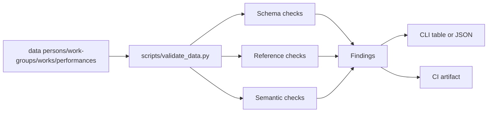

# Validation Guide

## Purpose

This repository validates canonical YAML data in `data/` against the architectural rules under `docs/architecture/`.

The validator enforces:

- YAML syntax and duplicate-key safety.
- Required fields for Person, Work Group, Work, and Performance.
- Referential integrity across canonical entities.
- Recommendation and gem semantics.
- Candidate-data containment boundaries.
- URL and Gramophone issue formatting.
- Duplicate heuristics as warnings (never auto-merge).

## Install

Python 3.13+ is required.

```bash
python -m pip install ruamel.yaml pydantic rich typer
```

Optional test dependencies:

```bash
python -m pip install pytest pytest-cov
```

## Run Validator

Human-readable output:

```bash
python scripts/validate_data.py
```

Machine-readable JSON output:

```bash
python scripts/validate_data.py --json
```

Exit code behavior:

- `0`: no validation errors.
- `1`: one or more validation errors.

Warnings do not fail validation.

## Interpret Failures

Each finding includes at minimum:

- `rule_id`
- `severity`
- `file`
- `message`

Example JSON finding:

```json
{
  "rule_id": "REF-004",
  "severity": "error",
  "file": "data/performances/example.yaml",
  "message": "Performance work_id must reference existing Work."
}
```

Use `rule_id` to cross-reference architecture policy:

- `docs/architecture/validation-rules.md`

## CI

Validation runs in GitHub Actions via:

- `.github/workflows/validate.yml`

The workflow:

- runs the human-readable validator (fails on errors),
- emits a JSON report,
- uploads it as the `validation-report` artifact.

## Validation Flow


